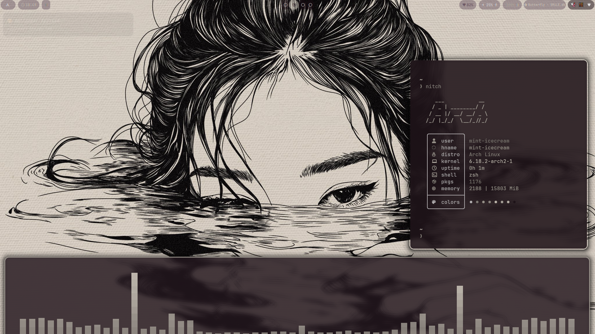

# 🎨 Hyprland Dotfiles

My first Hyprland rice! Contributions and suggestions are always welcome! 🫸🫷



## ✨ Features

- **Window Manager**: Hyprland (Wayland)
- **Panel**: Waybar with custom modules
- **Notifications**: SwayNC with blur effects
- **Terminal**: Kitty
- **Launcher**: Rofi
- **File Manager**: Thunar
- **Wallpaper**: SWWW with dynamic wallpaper daemon
- **Theme**: Pywal for automatic color generation from wallpapers
- **Lock Screen**: Hyprlock with blur
- **Window Manager Extensions**: Pyprland for additional features
- **Media**: MPV for video playback with thumbnail support

## 📦 Quick Installation

```bash
git clone https://github.com/Straew/dotfiles.git ~/.dotfiles
cd ~/.dotfiles/scripts
chmod +x install.sh
./install.sh
```

The installer will:
- Install all required programs (Hyprland, Waybar, Pywal, Pyprland, etc.)
- Backup your existing configs
- Copy all configurations to `~/.config/`
- Set up scripts in `~/.local/bin/`
- Generate initial pywal theme

## 🔧 Manual Installation

If you prefer manual installation:

```bash
# Core programs
yay -S hyprland hyprlock xdg-desktop-portal-hyprland wayland waybar swaync kitty zsh rofi-wayland wlogout swww python-pywal hyprpicker grim slurp swappy ffmpeg mpv pipewire wireplumber pavucontrol playerctl thunar thunar-volman gvfs ttf-jetbrains-mono-nerd noto-fonts noto-fonts-emoji polkit-kde-agent networkmanager network-manager-applet bluez bluez-utils blueman brightnessctl python python-pip python-pillow imagemagick jq fastfetch pyprland
# Optional programs
yay -S cava btop eza bat fd ripgrep fzf
```

Then copy configs manually:
```bash
cp -r .config/* ~/.config/
cp -r scripts/* ~/.local/bin/
chmod +x ~/.local/bin/*
```

## 🗑️ Uninstallation

```bash
cd ~/.dotfiles/scripts
chmod +x uninstall.sh
./uninstall.sh
```

This will:
- Create a backup before removal
- Remove all dotfiles configurations
- Optionally restore from previous backups

## 🖼️ Post Installation

### Add Wallpapers
Place your wallpapers in:
```bash
~/Pictures/Wallpapers/
```

### Generate Initial Theme
Press `Super + W` to select a wallpaper and generate the pywal color scheme.

### Scripts
All scripts are in `~/.local/bin/`:
- `salp` - Wallpaper selector with previews
- `walp` - Automatic wallpaper rotation (no manual selection)
- `wlogout.sh` - Logout menu
- `gamemode` - Performance mode toggle

## ⌨️ Keybinds

### General
| Keybind | Action |
|---------|--------|
| `Super + T` | Terminal (Kitty) |
| `Super + A` | App launcher (Rofi) |
| `Super + E` | File manager (Thunar) |
| `Super + Shift + E` | Emoji picker |
| `Super + M` | Reload Hyprland |
| `Super + D` | Toggle floating |
| `Super + P` | Pseudotile |
| `Super + J` | Toggle split |
| `Alt + F4` | Close window |

### Theming & Wallpapers
| Keybind | Action |
|---------|--------|
| `Super + W` | Wallpaper selector |
| `Super + R` | Restart Waybar |
| `Super + G` | Toggle gamemode |
| `Super + L` | Lock screen |

### Screenshots
| Keybind | Action |
|---------|--------|
| `Super + Print` | Screenshot |

### Window Management
| Keybind | Action |
|---------|--------|
| `Super + ←/→/↑/↓` | Move focus |
| `Super + 1-9` | Switch workspace |
| `Super + 0` | Workspace 10 |
| `Super + Shift + 1-9` | Move to workspace |
| `Super + S` | Scratchpad |
| `Super + Alt + S` | Move to scratchpad |
| `Super + Mouse Wheel` | Cycle workspaces |
| `Super + LMB` (drag) | Move window |
| `Super + RMB` (drag) | Resize window |
| `Super + Alt + F` | Window resize menu |

### System Controls
| Keybind | Action |
|---------|--------|
| `Super + F1` | Mute/unmute audio |
| `Super + F2` | Volume down |
| `Super + F3` | Volume up |
| `Super + F4` | Mute/unmute mic |
| `Super + F7` | Brightness down |
| `Super + F8` | Brightness up |

## 📁 Directory Structure

```
~/.dotfiles/
├── hypr/              # Hyprland configs
├── cava/              # Audio visualizer
├── fastfetch/         # System info
├── waybar/            # Status bar configs
├── kitty/             # Kitty terminal
├── rofi/              # App launcher
├── swaync/            # Notification center
├── wlogout/           # Logout menu
├── pyprland/          # Pyprland configs
├── wal/               # Pywal templates
├── colors/            # Color schemes
├── scripts/           # Utility scripts
│   ├── gamemode
│   ├── salp
│   ├── walp
│   └── wlogout.sh
├── install.sh         # Installation script
├── uninstall.sh       # Uninstallation script
└── README.md
```

## 🎨 Customization

### Change Colors
Colors are auto-generated from wallpapers using Pywal. The theme is automatically applied when you change wallpapers with `Super + W`.

To manually generate a theme:
```bash
wal -i /path/to/wallpaper.png
```

### Waybar Modules
Edit `~/.config/waybar/config` to add/remove modules.
Modules are split into separate files in `~/.config/waybar/modules/`.

### SwayNC Theme
Edit `~/.config/swaync/style.css` for notification styling.
Pywal colors are automatically applied to notifications.

## 🐛 Troubleshooting

### Wallpaper not changing
Check if swww daemon is running:
```bash
pgrep swww-daemon || swww-daemon &
```

### Pywal colors not applying
Make sure pywal is installed and wallpaper exists:
```bash
which wal
ls ~/Pictures/Wallpapers/
```

### Waybar not showing icons
Install Nerd Fonts:
```bash
yay -S ttf-jetbrains-mono-nerd
fc-cache -fv
```

### Blur not working
Check Hyprland version and decoration settings in `~/.config/hypr/modules/settings.conf`:
```bash
hyprctl version
```

### Pyprland not working
Make sure it's running:
```bash
pgrep pypr || pypr &
```
Or:
```bash
sudo rm -f /run/user/1000/hypr/*/.pyprland.sock
pypr & disown
```

### Installation issues
If the installer fails, try manual installation or check logs:
```bash
./install.sh 2>&1 | tee install.log
```

## 📝 Credits

- [Hyprland](https://hyprland.org/)
- [Claude.ai & YouTube] ✌

## 📄 License

Feel free to use and modify these dotfiles for your own setup!

---

**⭐ If you like this rice, give it a star!**
**you can give me your suggestions on discord too🥺(mint_icecreamm)**