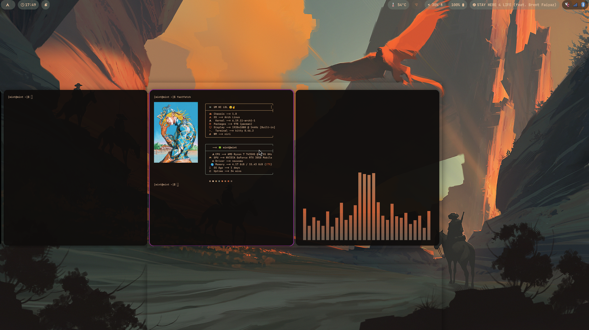

<div align="center">

# ✨ My Dotfiles

**A repo for both Hyprland and Niri**


</div>

---

## 📸 Screenshots

| Hyprland | Niri |
|----------|------|
|  |  |

---

## 🗂 Structure

```
dotfiles/
├── .config/
│   ├── hypr/          # Hyprland compositor config
│   ├── niri/          # Niri compositor config
│   ├── waybar/        # Status bar (shared)
│   ├── kitty/         # Terminal (shared)
│   ├── rofi/          # App launcher (shared)
│   ├── swaync/        # Notifications (shared)
│   ├── wlogout/       # Logout menu (shared)
│   ├── cava/          # Audio visualiser (shared)
│   ├── fastfetch/     # System info (shared)
│   ├── wal/           # Pywal templates (shared)
│   ├── colors/        # Color exports (shared)
│   ├── MangoHud/      # FPS overlay (shared)
│   ├── awww/          # Wallpaper config (Hyprland)
│   └── pyprland/      # Pyprland scratchpads (Hyprland)
├── scripts/           # Shell scripts for both WMs
├── install.sh         # Installer
└── README.md
```

The installer copies all **shared** configs and only the configs relevant to your chosen compositor.

---

## 🚀 Installation

### Prerequisites

- Linux distros that support hyprland,niri.
- `git`

### Steps

```bash
# 1. Clone the repo
git clone https://github.com/Straew/dotfiles.git
cd dotfiles

# 2. Run the installer
chmod +x install.sh
./install.sh
```

The installer will ask you:

1. **Which compositor** — Hyprland, Niri, or both
2. **What to install** — full install, packages only, or configs only
3. **Whether to back up** your existing configs before overwriting

> **Note:** The installer requires an AUR helper (`yay` or `paru`). If neither is found it will install `yay` automatically.

```bash
# uninstall
chmod +x uinstall.sh
./uninstall.sh 
```
---

## 🧩 Features

### Shared (both compositors)
| Feature | Tool |
|---------|------|
| Status bar | [Waybar](https://github.com/Alexays/Waybar) |
| Notifications | [SwayNC](https://github.com/ErikReider/SwayNotificationCenter) |
| Terminal | [Kitty](https://sw.kovidgoyal.net/kitty/) |
| App launcher | [Rofi (Wayland fork)](https://github.com/lbonn/rofi) |
| Logout menu | [Wlogout](https://github.com/ArtsyMacaw/wlogout) |
| Color theming | [Pywal](https://github.com/dylanaraps/pywal) |
| Color picker | [Hyprpicker](https://github.com/hyprwm/hyprpicker) |
| Screenshots | [Grim](https://sr.ht/~emersion/grim/) + [Slurp](https://github.com/emersion/slurp) + [Swappy](https://github.com/jtheoof/swappy) |
| Audio visualiser | [Cava](https://github.com/karlstav/cava) |
| System info | [Fastfetch](https://github.com/fastfetch-cli/fastfetch) |
| Audio | Pipewire + Wireplumber |
| File manager | Thunar |

### Hyprland only
| Feature | Tool |
|---------|------|
| Compositor | [Hyprland](https://hyprland.org) |
| Lock screen | [Hyprlock](https://github.com/hyprwm/hyprlock) |
| Wallpaper daemon | Awww|
| Scratchpads & more | [Pyprland](https://github.com/hyprland-community/pyprland) |

### Niri only
| Feature | Tool |
|---------|------|
| Compositor | [Niri](https://github.com/YaLTeR/niri) |
| Wallpaper daemon |AWWW |
| XWayland support | [Xwayland-satellite](https://github.com/Supreeeme/xwayland-satellite) |

---

## ⌨️ Keybinds

### Hyprland

| Keybind | Action |
|---------|--------|
| `Super + T` | Open Kitty terminal |
| `Super + A` | Rofi launcher |
| `Super + W` | wallpaper + generate pywal theme |
| `ALT   + F4`| Close active window |
| `Super + L` | Lock screen (Hyprlock) |
| `Super + 1–9` | Switch workspace |
| `Super + Shift + 1–9` | Move window to workspace |
| `Super + Alt + S` | Move to workspace 10|
| `Super + ~`   | Drop down terminal|
| `Super + Mouse drag` | Move / resize windows |
| `Super + E` | Thunar file manager |
| `Super + Print` | Screenshot|

### Niri

You can see most of the keybinds by hitting `Super+Shift+/`

| Keybind | Action |
|---------|--------|
| `Super + T` | Open Kitty terminal |
| `Super + A` | Rofi launcher |
| `Super + W` | wallpaper + generate pywal theme |
| `ALT+F4` | Close focused window |
| `Super + F` | Toggle fullscreen |
| `Super +ALT+ L` | Lock screen |
| `Super + E` | Thunar file manager |
| `Print` | Screenshot |

> Keybinds can be customised in `.config/hypr/modules/keybinds.conf` or `.config/niri/modules/binds.kdl`

---

## 🎨 Theming

Both compositors use **Pywal** to generate a full colour scheme from your wallpaper. All apps that support it (Waybar, Rofi, Kitty, Cava, etc.) automatically pick up the generated colours.

### Applying a new wallpaper + theme

```bash
# Both WMs — press Super + W, or run the script directly:
~/.local/bin/salp
```

Wallpapers are loaded from `~/Pictures/Wallpapers`. Add any `.jpg`, `.png`, or `.jpeg` images there. even vid can be kept as wallpaper but current not working on niri.

---

## 📦 Full Package List

<details>
<summary>Click to expand</summary>

### Core (shared)
`wayland` `waybar` `swaync` `kitty` `zsh` `rofi-wayland` `wlogout` `python-pywal` `imagemagick` `hyprpicker` `grim` `slurp` `swappy` `ffmpeg` `mpv` `pipewire` `wireplumber` `pavucontrol` `playerctl` `thunar` `thunar-volman` `gvfs` `ttf-jetbrains-mono-nerd` `noto-fonts` `noto-fonts-emoji` `polkit-kde-agent` `networkmanager` `network-manager-applet` `bluez` `bluez-utils` `blueman` `brightnessctl` `python` `python-pip` `python-pillow` `jq` `fastfetch`

### Hyprland
`hyprland` `hyprlock` `xdg-desktop-portal-hyprland` `awww` `pyprland` *(AUR)*

### Niri
`niri` `swww` `xdg-desktop-portal-gnome` `xwayland-satellite`

### Optional
`cava` `btop` `eza` `bat` `fd` `ripgrep` `fzf`

</details>

---

## 🔧 Manual Steps After Install

A few things the script can't do for you:

1. **Log out and select your compositor** from your display manager
2. **Add wallpapers** to `~/Pictures/Wallpapers`
3. If fonts look wrong, run: `fc-cache -fv`
4. If Bluetooth doesn't appear, check: `systemctl status bluetooth`

---

## 💾 Backup & Restore

The installer offers to back up your existing configs before overwriting. Backups are saved to:

```
~/.config/dotfiles_backup_YYYYMMDD_HHMMSS/
```

To restore:
```bash
cp -r ~/.config/dotfiles_backup_YYYYMMDD_HHMMSS/waybar ~/.config/waybar
# repeat for any dir you want to restore
```

---

## 🐛 Troubleshooting

### Wallpaper not changing

**Check if awww daemon is running:**
```
pgrep awww-daemon || awww-daemon &
```
### Pywal colors not applying
**Make sure pywal is installed and wallpaper exists:**
```
which wal
ls ~/Pictures/Wallpapers/
```

### Waybar not showing icons

**Install Nerd Fonts:**
```
yay -S ttf-jetbrains-mono-nerd
fc-cache -fv
```
### Blur not working (on hyprland only)
Check Hyprland version and decoration settings in ```~/.config/hypr/modules/settings.conf:``` ```hyprctl version```

### Pyprland not working

**Make sure it's running:**
```
pgrep pypr || pypr &
```
Or:
```
sudo rm -f /run/user/1000/hypr/*/.pyprland.sock
pypr & disown
```
### Installation issues

If the installer fails, try manual installation or check logs:
```
./install.sh 2>&1 | tee install.log
```

<div align="center">
I use Arch Linux btw :)
</div>